Visualizzazione dati COVID-19 in Italia
================

Progressione totale positivi, relativa a inizio epidemia locale
===============================================================

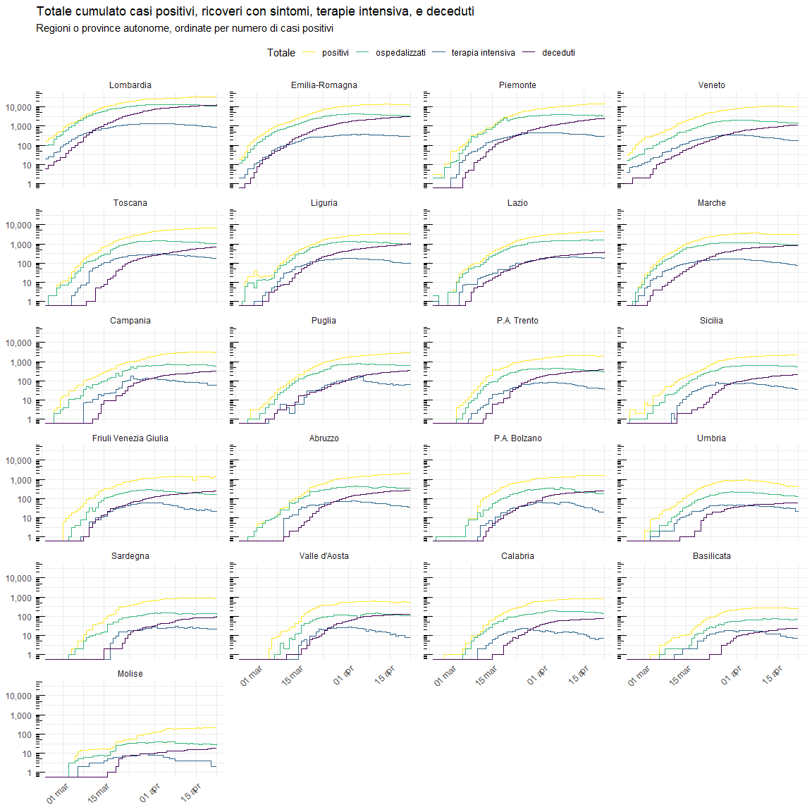

Progressione totale positivi per data
=====================================

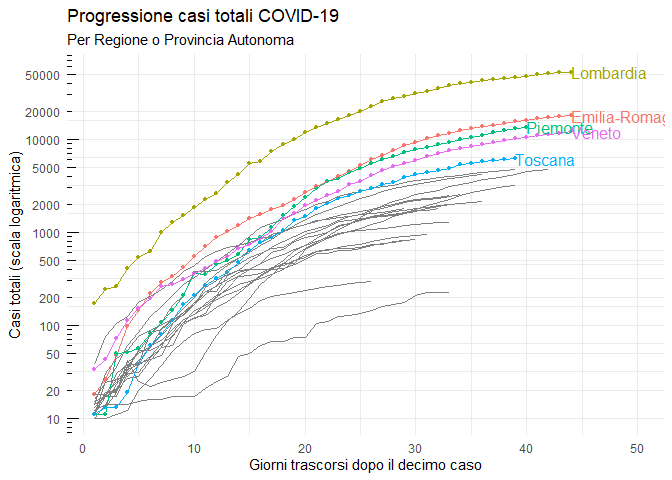

Decessi complessivi
===================

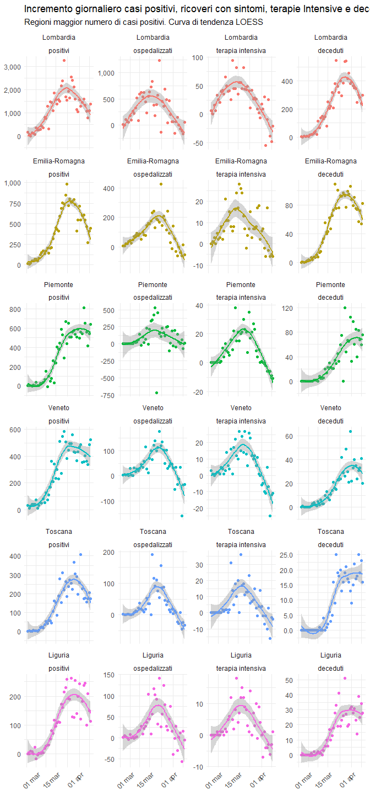

Curve di casi Totale per Regione
================================

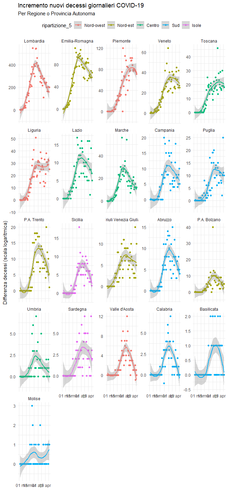

Incrementi Giornalieri per Regione
==================================

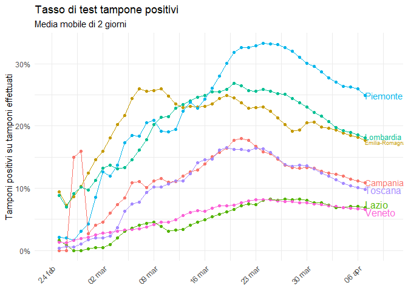

Ripartizioni geografiche
========================

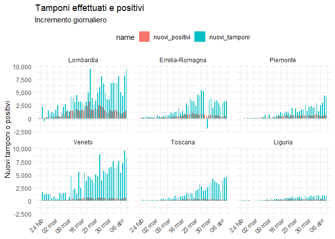

Tasso tamponi positivi
======================

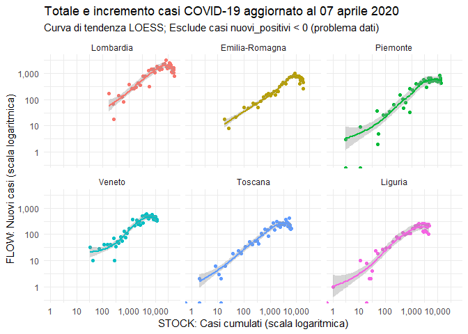

Nuovi tamponi e nuovi positivi
==============================

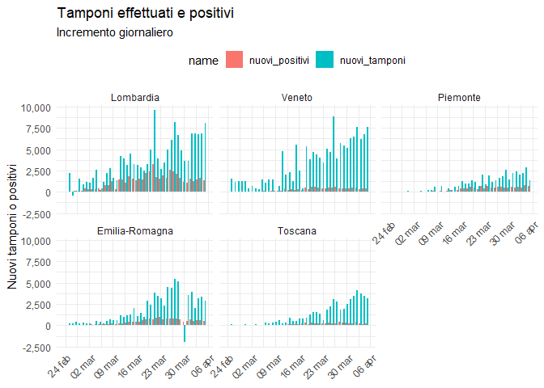

Ospedali e terapia intensiva
============================

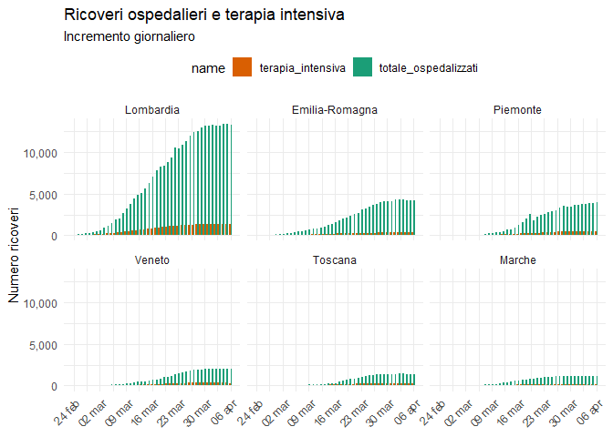

Stock e flow casi
=================

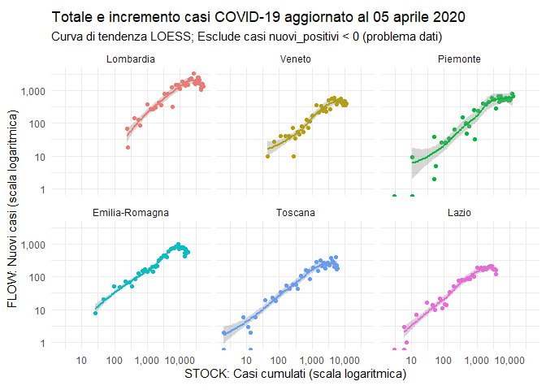

Distibuzione nuovi casi giornalieri (bunching?)
===============================================

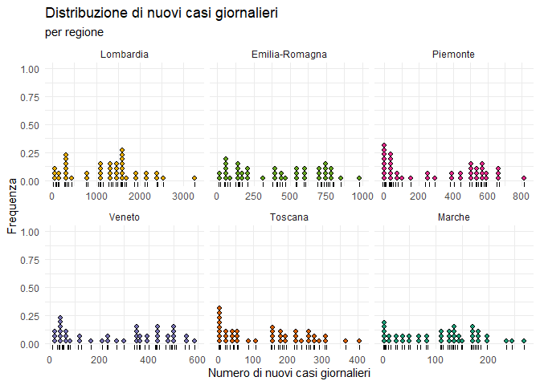
