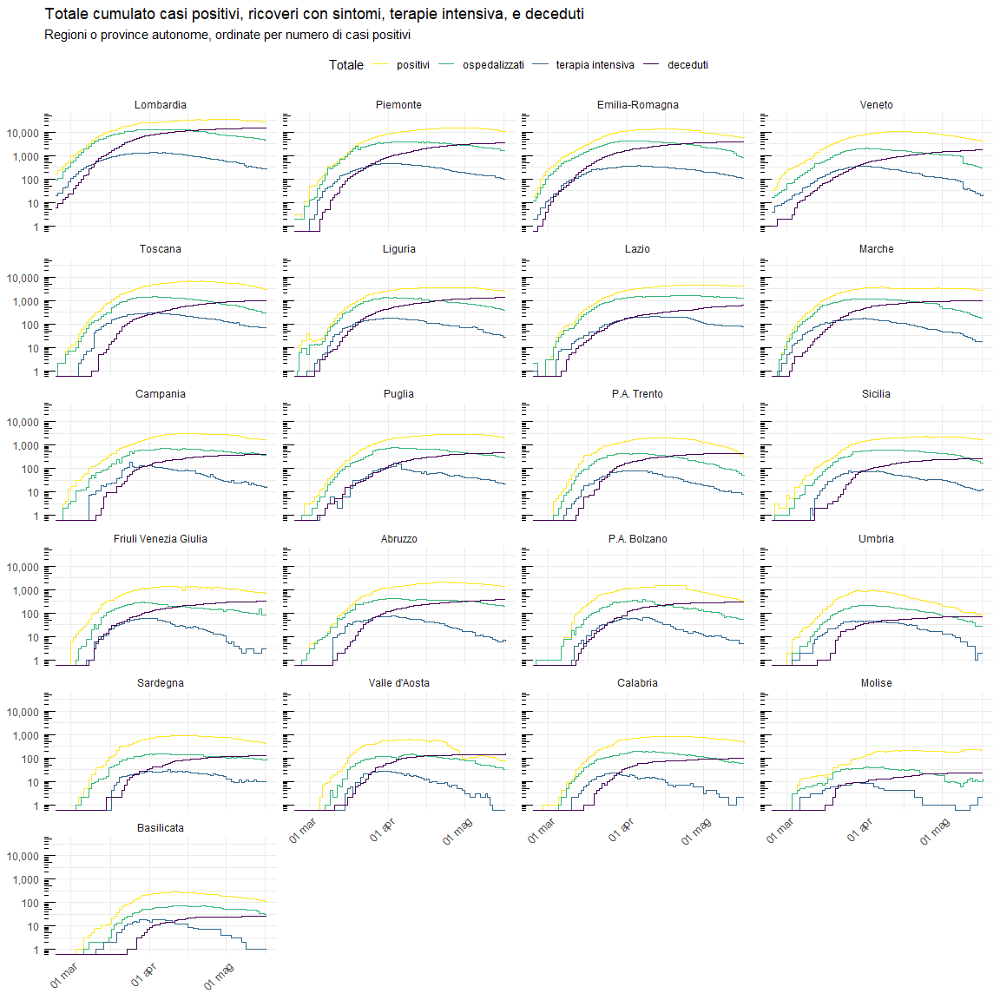

Visualizzazione dati COVID-19 in Italia
================

Progressione relativa
=====================

``` r
# Elenco ordinato di regioni da includere nel grafico
regioni_scelte <- c("Lombardia", "Veneto", "Piemonte", "Emilia-Romagna", "Toscana")

dati_regionali %>%
  mutate(regione_evidenziata  = if_else(regione %in% regioni_scelte, regione, NA_character_)) %>% 
  group_by(regione) %>% 
  filter(totale_casi >= 10) %>% 
  mutate(giorno_epidemia = 1:n()) %>% 
  ggplot(aes(x = giorno_epidemia, y = totale_casi, group= regione, color = regione_evidenziata)) +
  geom_point(data = . %>% filter(!is.na(regione_evidenziata)), size = 1) +
  geom_line() +
  scale_y_log10() + annotation_logticks(sides = "l") +
  labs(
    title = "Progressione casi totali COVID-19", subtitle = "Per Regione o Provincia Autonoma",
    x = "Giorni trascorsi dopo il decimo caso", y = "Casi totali (scala logaritmica)"
  )
```



Grafici andamento regionale nel tempo
=====================================


Incrementi Giornalieri per Regione
==================================


Curve di casi Totale per Regione
================================


Ripartizioni geografiche
========================


Tasso tamponi positivi
======================


Nuovi tamponi e nuovi positivi
==============================


Ospedali e terapia intensiva
============================


Stock e flow casi
=================


Distibuzione nuovi casi giornalieri (bunching?)
===============================================


