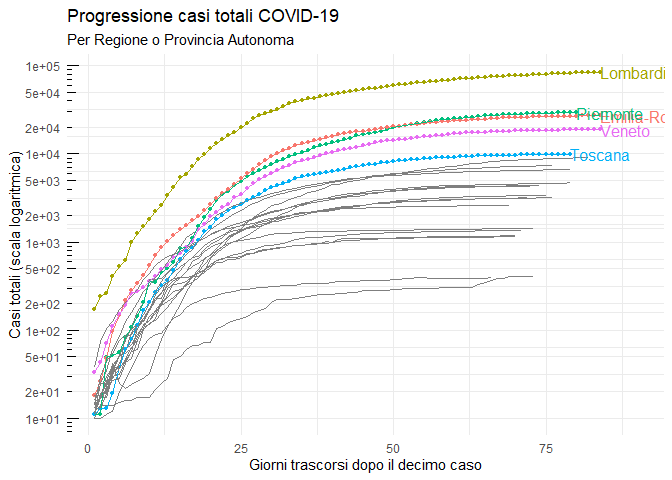
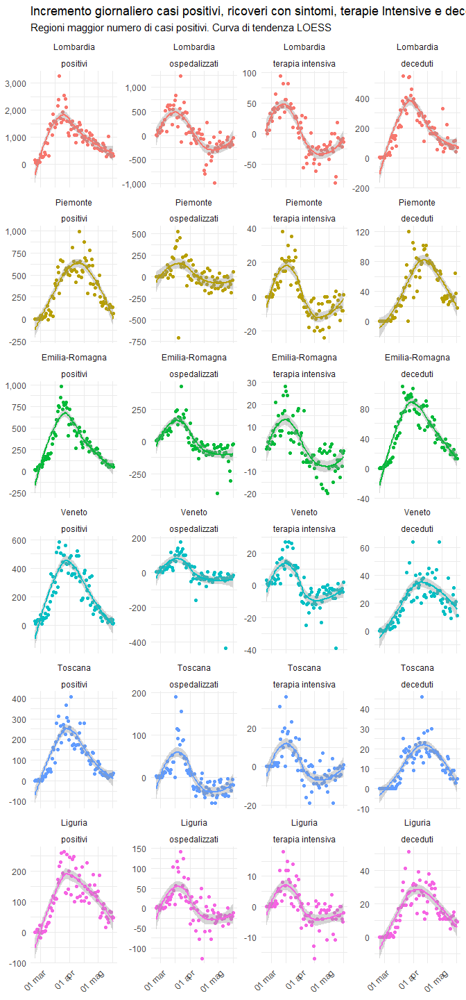
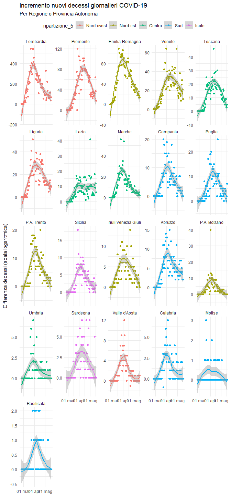
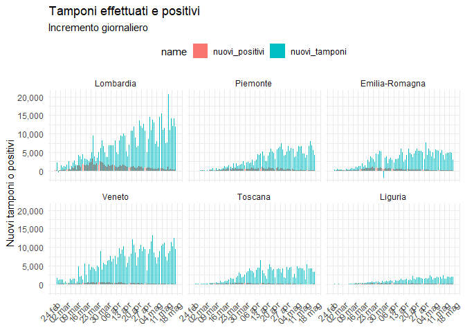

Visualizzazione dati COVID-19 in Italia
================

Grafici andamento regionale ----
================================

Incrementi Giornalieri per Regione
==================================

Curve di casi Totale per Regione
================================

Ripartizioni geografiche
========================

Tasso tamponi positivi
======================

Nuovi tamponi e nuovi positivi
==============================

Ospedali e terapia intensiva
============================

Stock e flow casi
=================

Distibuzione nuovi casi giornalieri (bunching?)
===============================================

