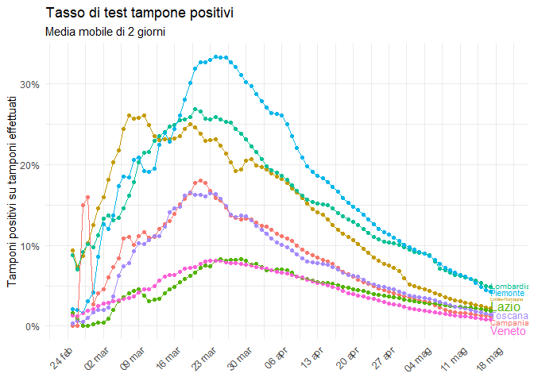

Visualizzazione dati COVID-19 in Italia
================

Progressione epidemia nel tempo
===============================

Progressione relativa regioni, da inizio epidemia locale
========================================================

Incrementi giornalieri per regioni più colpite
==============================================

Nuovi decessi giornalieri
=========================

Tasso tamponi positivi
======================

Nuovi tamponi e nuovi positivi
==============================

Stock e flow casi
=================

